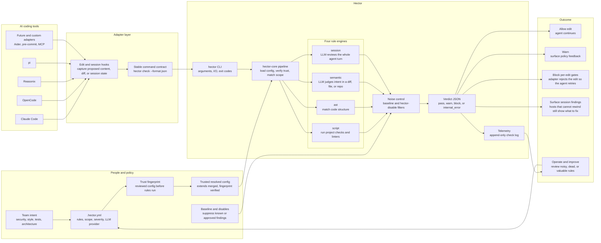

# Architecture diagram

Hector turns repo-local policy into an automatic gate for AI coding agents. The short version: adapters catch edits, the `hector` binary checks those edits against trusted rules, and the adapter turns the verdict back into "keep going" or "fix this first."

## What this shows

- **Policy lives with the code.** The `.hector.yml` travels with the repo, so every agent sees the same rules and severities.
- **Adapters are thin.** Claude Code, OpenCode, Reasonix, pi, and future adapters capture host events and consume Hector's verdict. Policy logic stays in `hector-core`.
- **Rules scale from cheap to smart.** Use shell checks and AST matching for deterministic policies, then semantic and session rules when the question needs judgment across a diff, file, repo, or full agent turn.
- **Trust comes before power.** Script rules can execute commands, so Hector verifies the signed config before any rule runs.
- **The verdict is machine-readable.** `pass`, `warn`, `block`, and `internal_error` map to stable exit codes that agents and CI can act on automatically. Per-edit gates can block immediately; post-turn session checks surface findings when a host cannot rewind a completed turn.
- **The system improves over time.** Baselines and disables keep adoption practical; telemetry shows which rules are noisy, valuable, or dead.

## Mental model

Hector is not another linter. It is the policy layer around AI-generated edits: local enough to understand a repository's rules, structured enough for deterministic gates, and flexible enough to ask an LLM about the policies that ordinary tools cannot express.
