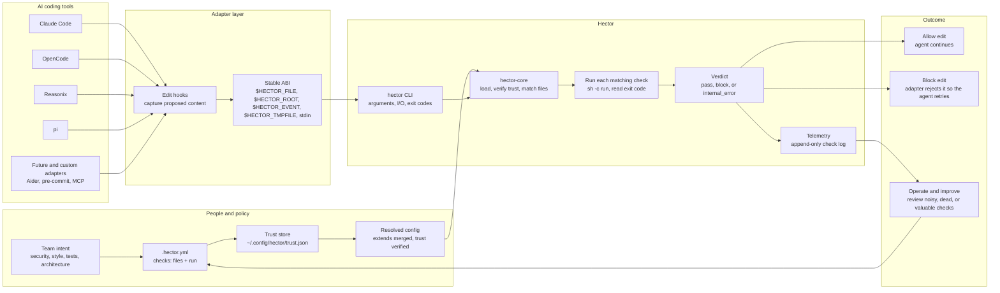

# Architecture diagram

Hector turns repo-local policy into an automatic gate for AI coding agents. The short version: adapters catch edits, the `hector` binary runs the matching checks against each edit, and the adapter turns the verdict back into "keep going" or "fix this first."

## What this shows

- **Policy lives with the code.** The `.hector.yml` travels with the repo, so every agent runs the same checks.
- **Adapters are thin.** Claude Code, OpenCode, Reasonix, pi, and future adapters capture host edit events and consume Hector's verdict over a stable ABI. No policy logic lives in the adapter.
- **One execution model.** Hector matches the edited file to checks and runs each check's `run` command, reading only the exit code. There are no engines and no severities — a check blocks on any nonzero exit (1–125) and owns its own message.
- **Trust comes before power.** A check runs shell, so Hector refuses to run a config whose bytes — and its `.hector/gates/` scripts — aren't blessed in the out-of-repo trust store.
- **The verdict is machine-readable.** `pass`, `block`, and `internal_error` map to stable exit codes that agents and CI act on. A per-edit check blocks immediately, so the agent retries before the change lands.
- **The system improves over time.** Telemetry records what ran, what blocked, and how long it took, so you can see which checks are noisy, valuable, or dead.

## Mental model

Hector is not another linter. It is the portable substrate beneath your linters: it normalizes every harness's edit hook into one ABI, runs the same check commands everywhere, and turns their exit codes into a deterministic gate an agent must clear before its edit lands.
