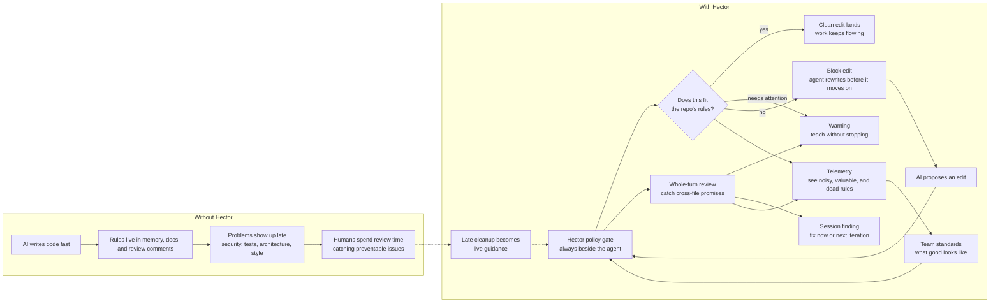

# Visual elevator pitch

Hector turns "please follow our rules" into an automatic feedback loop for AI coding agents. Good edits keep moving. Risky edits get stopped or surfaced while the agent can still fix them.

## The pitch

- **For teams:** Hector makes standards enforceable at the moment code is written, not after the review queue is already full.
- **For agents:** Hector gives precise feedback, so the agent can correct itself instead of guessing what "good" means in this repo.
- **For reviewers:** Hector absorbs the repetitive policy checks, leaving humans more room for design, product judgment, and taste.
- **For operators:** Hector leaves a trail, so teams can see which rules are helping, which are noisy, and which need tightening.

## One sentence

Hector is a seatbelt for AI coding: it lets agents move quickly while keeping the work inside the rules your team actually cares about.
